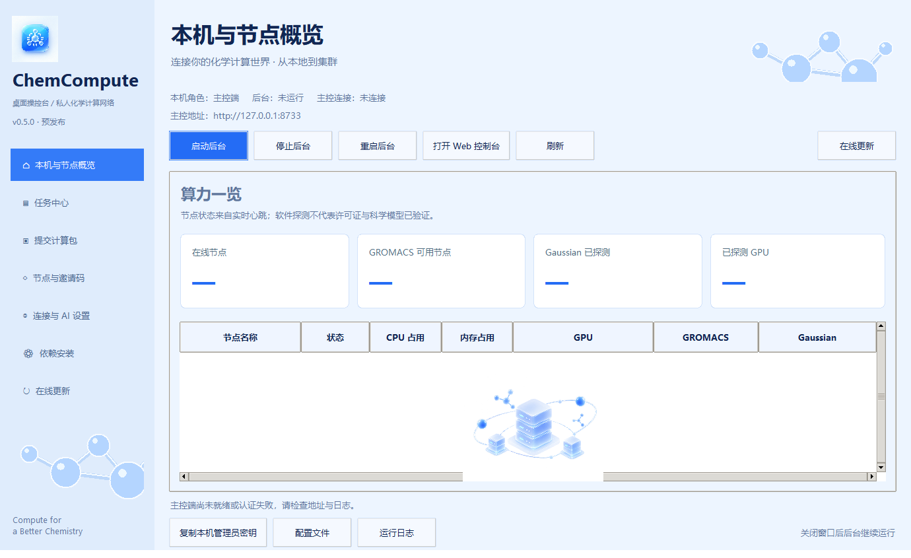

# ChemCompute

## v0.6.0 专属邀请部署与 Gaussian 安装服务

新增专属邀请部署包：预填一次性邀请码与 HTTPS 地址，默认计算节点和登录启动，安装后自动注册。Gaussian/GaussView 安装介质可由用户私下附带，支持厂商安装向导与路径探测。融合 Tenacity，为更新下载提供最多三次网络错误重试。桌面保留浅蓝配色、左侧导航与算力卡片。节点概览、任务中心、计算包提交、邀请码、连接与 AI、依赖安装和在线更新功能保持可用。状态来自实际后台与节点心跳。在线更新包含官方版本检查、下载进度与取消、SHA-256 校验、任务空闲检查及保留数据的重启安装。

详见 [在线更新说明](docs/online-update.md) 与 [兼容性检查](docs/audit-2026-09-12.md)。预发布版；更新需要短暂重启，不承诺运行中替换或自动回滚。



将 Windows 电脑接入私人化学计算网络的开源 MVP。包含 Inno Setup 安装器、FastAPI/SQLite 控制端、中文 Web Console、后台节点代理、GROMACS 与 Gaussian 适配器。MIT 许可。

**这是 0.6.0 预发布版。Windows 安装包已内置 Python 与 Tk，目标电脑不需要另装 Python。** 安装页面默认勾选 WSL、GROMACS 和匹配的显示驱动安装，可分别取消。程序通过在线官方/发行版源安装依赖，安装器不包含商业软件或许可证。Gaussian 使用节点已有授权安装。已验证 WSL GROMACS 两水分子 100 步 CPU 冒烟计算；不代表科学模型有效性。两个逻辑节点的并发分配已测试；不同物理电脑的吞吐量和无人登录开机运行尚未验证。

详见 [专属邀请部署与 Gaussian 安装指南](docs/invited-deployment.md) 和 [开源组件说明](docs/open-source-integrations.md)。

## 安装与第一次运行

1. 从 GitHub Releases 下载 `ChemCompute-Setup.exe`，对照 `SHA256SUMS.txt` 校验。安装包尚未代码签名。
2. 双击安装，选择 Controller、Compute node 或 Both。首次尝试选择 Both，即可在本机自动注册节点。
3. Controller 默认监听 `127.0.0.1:8000`。若其他电脑需要加入，请填本机 Tailscale IP，并在节点上填对应 URL 与控制台生成的单次邀请码。
4. 安装后自动创建桌面和开始菜单的 `ChemCompute Console` 快捷方式。安装结束后后台自动启动；打开原生桌面操控台即可查看连接状态和节点列表。新版任务中心、计算包上传、结果下载、邀请码及 AI 设置均可在桌面端完成。仅使用旧版 Web 页面时，管理员密钥在 `%LOCALAPPDATA%\ChemComputeData\data\chemcompute-admin.secret`，用记事本打开后粘贴到登录框。
5. 在控制台查看节点 CPU、RAM、GPU 与软件探测，生成/撤销邀请码，创建 GROMACS 作业并查看状态和日志。

默认安装至当前用户目录，不要求管理员权限。可选“登录时启动”使用当前用户启动项；**不是原生 Windows Service，不保证注销后或登录前运行**。安装包不自动修改防火墙、SSH 或 Tailscale 登录。

默认本机角色为主控 + 计算节点。本部署的远程入口为 `https://chemcompute.666945726.xyz`，由本机 Cloudflare Tunnel 连接，不把域名当作监听 IP。远程电脑选择 Compute node，输入该 URL 与单次邀请码。

配置、数据库、日志保存在 `%LOCALAPPDATA%\ChemComputeData`，升级保留已有配置。卸载删除程序与启动项，保留数据以便恢复。更换角色或主控地址需编辑 `config/*.yaml` 后重启程序。停止/重启后台可在桌面操控台操作；关闭桌面窗口后后台继续运行。升级/卸载前先停止后台并确认没有计算任务。旧版 0.1.0 未记录进程身份，首次升级前请在任务管理器退出旧程序。

## 网络部署

主控和节点加入同一个受控 Tailscale 网络；先完成各自登录，然后将主控监听 IP 改为其 Tailscale IP。此 MVP 的 HTTP 不提供 TLS，**只用于本机或加密的 Tailscale 链路**，其他网络必须另行配置 HTTPS 反向代理。限制 tailnet ACL；不要映射到公网。

可选脚本（仅检测时不修改系统）：

```powershell
.\scripts\network.ps1
.\scripts\network.ps1 -InstallTailscale
.\scripts\network.ps1 -ConnectTailscale
# 仅在确实需要 SSH 时，以管理员 PowerShell 运行：
.\scripts\network.ps1 -EnableOpenSSH
```

SSH 并不是代理工作的前提。脚本将新建 SSH 规则限制到 Tailscale IPv4 地址段；仍需用 Tailscale ACL 和 SSH 账号权限限制访问。

## 源码运行

需要 Python 3.12。以下命令在仓库根目录执行：

```powershell
python -m venv .venv
.\.venv\Scripts\python -m pip install -r requirements-dev.txt
.\.venv\Scripts\python -m chemcompute.cli setup --role both
.\.venv\Scripts\python -m chemcompute.cli controller run
# 另一终端生成邀请码，在节点配置填入邀请码后运行：
.\.venv\Scripts\python -m chemcompute.cli controller invite create
.\.venv\Scripts\python -m chemcompute.cli node run
```

安装版运行时位置也可通过 `CHEMCOMPUTE_HOME` 指定（用于测试/隔离实例）。示例配置在 `examples/`，不要把实际邀请码或令牌提交到 Git。

## GROMACS 范围

检测 PATH 或配置中的原生 `gromacs_custom_path`，无原生 EXE 时检测默认 WSL 发行版中的 GROMACS，执行真实 `gmx --version`。WSL 使用独立参数调用，不拼接 bash 命令。支持受限的 `check/grompp/mdrun/editconf/solvate/genion/energy` 子命令，传递参数列表，禁止 shell、目录逃逸，限制超时并保留最多 500 KB stdout/stderr。命令 `version` 映射到 `gmx --version`。

新版桌面任务使用独立的 `/api/v2` 队列：上传 ZIP，预览步骤，选择资源要求及节点，提交后由节点拉取计算包，逐步执行并上传结果。心跳线程独立运行，单节点一次执行一个新版任务。旧 Web `/api/v1` 作业界面保持兼容；不要同时用两种队列调度同一节点。

计算包上限 100 MiB、展开上限 512 MiB、最多 2000 文件，压缩比不超过 200；拒绝目录穿越、链接、加密 ZIP、Windows 危险名称、重复名称和 CRC 错误。计算结果采用不压缩 ZIP，所含文件总量因此也需小于约 100 MiB。超限任务会失败，文件保留在节点本机。现阶段不适合大型生产轨迹。

支持跨节点独立任务/副本分配，以及失联后的原节点恢复；不支持把一个 MPI/Linda 作业跨互联网拆到多台电脑或原生系统服务。进度按完成步骤更新，不是 MD 步数百分比。原生子进程支持取消；WSL 取消在当前步骤退出后确认，步骤时限由 WSL 的 GNU `timeout` 控制。运行租约到期后进入 recovering。节点重连会恢复租约、重放本地持久记录并补传结果；代理意外重启时先确认旧计算进程结束，再从 GROMACS 检查点续算。缺失检查点、Gaussian 进程中断等情况保留文件并要求人工处理。不会仅凭超时把仍可能运行的任务重派到另一台电脑。CPU/RAM/GPU 是分配准入条件，不是操作系统资源隔离，线程数等科学参数仍需自行设置。工作目录不是 OS 沙箱，仅处理可信输入。

## 构建和验证

```powershell
python -m pip install -r requirements-dev.txt
ruff check .
python -m pytest -q
# 安装官方 Inno Setup 6，然后：
.\scripts\build.ps1 -Python python -ISCC 'C:\Program Files (x86)\Inno Setup 6\ISCC.exe'
python scripts\smoke_exe.py dist\ChemCompute\ChemCompute.exe
```

输出：`dist/ChemCompute-Setup.exe` 和 `dist/SHA256SUMS.txt`。构建步骤可重复执行，但不承诺二进制逐字节相同。GitHub Actions 会在 Linux/Windows 测试，在 Windows 打包并运行 EXE 端到端检查；推送 `v*` 标签会发布预发行版。详见 [架构](docs/architecture.md)、[发布说明](docs/releasing.md) 与 [安全边界](SECURITY.md)。

官方参考：[Inno Setup 编译器](https://jrsoftware.org/ishelp/topic_compilercmdline.htm)、[Tailscale 无人值守配置](https://tailscale.com/docs/how-to/run-unattended)。后者只影响联网工具，不会把 ChemCompute 变成系统服务。

## 桌面工作流（0.3.0）

1. **本机与节点概览**：启动/停止/重启后台，查看 CPU、RAM、GPU、GROMACS，打开日志和配置目录。关闭窗口后后台继续运行。
2. **节点与邀请码**：创建、查看、撤销单次邀请码；停止后台后更新本节点入网地址、名称和邀请码。
3. **连接与 AI 设置**：连接远程主控（URL + 管理员密钥），保存 DeepSeek 密钥和模型，测试连接。留空 URL 使用本机主控；空密钥输入保留现有值。密钥通过 Windows DPAPI 加密，绑定当前账号，其他电脑需分别配置。安装包和 GitHub 不包含任何运行密钥。
4. **提交计算包**：选择 ZIP；可含根目录 `chemcompute.json` 自动填写任务名和步骤。内置版本检查、预处理 + MD、运行已有 TPR、结构检查模板；可追加命令和参数，也可编辑步骤 JSON。最多 16 步，支持 CPU/内存/CUDA 要求、超时和优先级。
5. **DeepSeek 建议节点**：只发送任务说明、步骤、文件名和候选节点资源摘要，不发送文件正文。AI 只能从满足条件的在线节点中选择，不能生成执行代码或修改步骤；预览后手动提交。调用按 DeepSeek 账号计费；失败时仍可自动匹配或手动选择节点。
6. **任务中心**：刷新状态，查看步骤日志与详情，取消任务，复制已结束任务重试，下载并校验结果 ZIP。

[桌面使用指南](docs/desktop-guide.md) 包含无 Python 安装、计算包格式、示例和限制。[DeepSeek 官方 API](https://api-docs.deepseek.com/)；默认模型可在设置里修改。


## 0.3.0：Gaussian、依赖安装与恢复

Gaussian 任务选择 `gaussian`，上传含 `.gjf` 或 `.com` 的 ZIP，步骤为 `{"subcommand":"run","arguments":["input.gjf"]}`。默认命令不修改 `%mem`、`%nprocshared`、方法、基组或分子内容；在节点页配置合法 `g16.exe/g09.exe` 路径。静态找到程序不等于授权有效或实际计算验证。日志需出现 Normal termination 才判定成功。Gaussian 中断后不自动改写输入猜测续算方法；原目录与 chk 文件保留。

跨机副本数 1–128 会创建一组独立任务，由可用节点逐个领取；副本共用输入，不自动修改随机种子。它不是 MPI/Linda 分布式单作业。AI 会按所选软件及资源筛选节点。所有参与新版队列的节点必须升级到 0.3.0。

依赖安装页可安装或继续所选组件，查看安装状态和失败原因。需要管理员权限、联网和可能的系统重启；不强制重启。Ubuntu/Debian 仓库 GROMACS 可能为 CPU 构建，勾选显卡驱动不等于获得 CUDA 版 GROMACS。驱动通过 Windows Update 选择硬件匹配的 Display 更新，不安装 WSL Linux 显示驱动。首次干净电脑的完整安装链尚待实机验证。

参见 [部署、恢复与 Gaussian 指南](docs/deployment-v0.3.md)。
