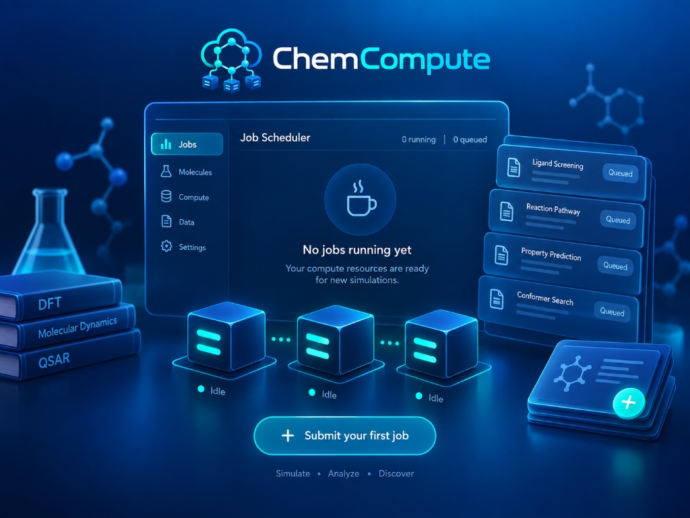

<p align="center">
  
</p>

<h1 align="center">ChemCompute</h1>
<p align="center"><strong>面向现代化学模拟、材料计算与多物理场仿真的私有分布式智能算力调度平台</strong></p>

<p align="center">
  <a href="https://github.com/C12isme945/ChemCompute/releases/tag/v0.3.0">
    
  </a>
  
  
</p>

<p align="center">
  
</p>

---

> **ChemCompute** 旨在让科研团队与个人计算者无需采购昂贵超算机时，一键将宿舍电脑、实验室工作站或云端 GPU 机器汇聚为专属、无人值守的科研计算集群。
> 最新正式版安装包现已发布至 GitHub Release：
> 👉 **[点击下载最新发布包 ChemCompute-Setup.exe (v0.3.0)](https://github.com/C12isme945/ChemCompute/releases/tag/v0.3.0)**
> `SHA256: 5e75044bf8297a52ae324616a89d1175a877d20037c6f1f35ab39d831f7e169a`

---

## 核心架构

```
                 ┌─────────────────────────────┐
                 │    ChemCompute Controller   │
                 │   Web 控制台 / REST 调度器  │
                 │   http://<主控IP>:8000      │
                 └──────────────┬──────────────┘
                                │ (Tailscale / 局域网 / 外网)
                     邀请码认证 CC-XXXXXX
                                │
        ┌───────────────────────┼───────────────────────┐
        ▼                       ▼                       ▼
 ┌──────────────┐        ┌──────────────┐        ┌──────────────┐
 │  Node-3060   │        │  Node-Lab01  │        │ Node-Cloud40 │
 │  RTX 3060    │        │  CPU 64 核   │        │ RTX 4090     │
 ├──────────────┤        ├──────────────┤        ├──────────────┤
 │ ChemCompute  │        │ ChemCompute  │        │ ChemCompute  │
 │    Agent     │        │    Agent     │        │    Agent     │
 └──────┬───────┘        └──────┬───────┘        └──────┬───────┘
        │                       │                       │
   GROMACS (GPU)           ORCA / CPU             GROMACS (GPU)
```

---

## 角色区分与快速上手指南

ChemCompute 明确划分为三大角色，下载后无需复杂配置：

| 角色身份 | 适用人群与机器 | 运行方式 | 职责与权限 |
| :--- | :--- | :--- | :--- |
| **👑 主控管理员 (Admin)** | 课题组长 / 实验室管网员 / 拥有长期开机电脑 | 双击 `启动-管理员主控台.bat` 或运行 `python main.py` 选 1 | 启动调度中心，掌握**管理员密钥**，管理节点与灰度更新 |
| **💻 普通计算节点 (Worker)** | 组员电脑 / 宿舍游戏本 / 实验室 GPU 服务器 | 双击 `启动-普通计算节点.bat` 或运行 `ChemCompute-Setup.exe` | 填入管理员密钥加入集群，后台默默贡献 CPU/GPU 算力 |
| **🔬 科研作业提交者 (Submitter)** | 需要算分子动力学或量化的组员与研究生 | 浏览器直接访问管理员给的 Web 网址 (如 `http://<IP>:8000`) | 无需安装复杂环境，在 Web 界面**选用官方范本**或传文件投任务 |

---

### 1. 管理员：启动主控端并复制【管理员密钥】
在管理员主机上，直接双击根目录下：
👉 **`启动-管理员主控台.bat`** (或命令行 `uv run python scripts/start_controller.py`)

终端与浏览器控制台将自动启动：
- **控制台地址**：`http://127.0.0.1:8000` (或局域网 IP `http://192.168.x.x:8000`)
- **复制管理员密钥**：
  - **在 Web 界面顶部**：右上角常驻 **【🔑 管理员密钥: CC-XXXXXX】** 快捷卡片，点击即可一键复制密钥或完整加入指令！
  - **在启动终端中**：启动成功后终端居中打印醒目的管理员密钥与节点接入命令。

---

### 2. 普通节点：输入管理员密钥加入集群
想要贡献算力的电脑上，直接双击：
👉 **`启动-普通计算节点.bat`**
- 提示输入主控端地址（默认回车为 `http://127.0.0.1:8000`，或输入管理员电脑的局域网 IP）；
- 提示输入管理员给您的 **【管理员密钥 (如 CC-XXXXXX)】**；
- 节点将自动完成硬件探测（GPU/CUDA/WSL/CPU/RAM）并接入集群待命。

---

### 3. 科研提交者：使用计算输入文件范本
在 Web 控制台点击 **“新建作业”**：
- **⚡ 一键载入官方范本**：窗口内直接提供 **💧 GROMACS 水分子动力学** 与 **🧪 ORCA 几何优化** 范本，点击 **【一键填入】** 即可免传压缩包直接确认提交！
- **📥 下载标准范本压缩包**：点击 **【下载范本.zip】** 即可把标准文件结构下载到本地参考或修改；
- **📁 输入包目录规范说明**：窗口提供可折叠规范指引，明确 `.mdp`、`.gro`、`.top` 或编译好的 `.tpr` 文件命名要求。

---

## 目录与组件说明

```
ChemCompute/
├── chemcompute/
│   ├── common/             # 数据模型 (Pydantic)、发布 Manifest、灰度通道定义
│   ├── controller/         # FastAPI 服务端、发布中心、WebSocket 网关、调度器
│   │   ├── routes/         # nodes, jobs, enroll, updates (发布管理与通道晋级)
│   │   ├── websocket.py    # 双向实时广播网关 (节点推送与控制台订阅)
│   │   └── static/         # 现代化 Web 控制台 (Grid 计算网关 + Updates 灰度发布页面)
│   ├── agent/              # 节点守护进程、硬件采集、沙箱执行器
│   │   ├── plugin_manager.py # 算力适配器独立插件管理器 (免重启动态热重载)
│   │   ├── config_manager.py # 动态配置中心 (node.yaml 实时热推送生效)
│   │   └── update_client.py  # 任务感知更新客户端 (WebSocket 推送 + 兜底轮询)
│   ├── updater/            # 独立双进程更新器 (SHA256 校验、原子替换与自动回滚)
│   └── adapters/           # 软件计算适配器 (GROMACS, ORCA 等动态插件)
├── installer/
│   ├── chemcompute_setup.iss # Inno Setup 7 编译脚本
│   └── bootstrapper.ps1      # 交互式 PowerShell 一键自检与入网安装脚本
├── scripts/
│   ├── start_controller.py   # 主控服务启动入口
│   ├── start_agent.py        # 节点守护进程启动入口 (支持 --channel 与 --version)
│   ├── run_updater.py        # 独立更新进程入口 (ChemComputeUpdater)
│   ├── build_agent_exe.py    # PyInstaller 单体 exe 打包脚本
│   ├── build_installer.ps1   # 完整自动化打包流水线
│   ├── e2e_verify.py         # GROMACS 计算端到端验证脚本
│   └── e2e_verify_update.py  # 三层热更新与灰度发布全流程端到端联调脚本
└── dist/
    ├── ChemCompute-Setup-0.1.0.exe           # Windows 图形化安装包
    ├── ChemCompute-Node-Portable-v0.1.0.zip   # 绿色免安装发布包
    └── ChemComputeAgent/                     # 独立运行的 Agent 可执行文件
```

---

## 三层热更新与灰度发布体系 (Hot Update & Phased Rollout)

系统采用专为科学计算集群设计的原生三层热更新体系：

1. **第一层：Agent 核心更新 (双进程架构 + 自动回滚)**：
   - 节点采用 `agent/current`（运行版）、`agent/previous`（稳定回滚版）与 `agent/staging`（暂存验证版）三态目录。
   - 独立 `ChemComputeUpdater` 进程负责下载新版、校验 SHA256、等待原进程退出、原子目录替换并启动新版本。
   - 启动后实施 30~60 秒健康探针检查；若新版本崩溃或无法响应，**自动无损回滚**并重新拉起 `previous/` 稳定版，杜绝远端机器离线。

2. **第二层：Adapter 算力插件热更新 (免重启)**：
   - 适配器作为独立 zip 插件包（如 `orca-adapter-5.0.4.zip`）进行分发。
   - Agent 内置 `PluginManager`，只要对应适配器当前无正在运行的计算作业，即可就地解压并使用 `importlib` 动态热重载，**完全无需重启 Agent 守护进程**。

3. **第三层：配置热推送 (Config Push)**：
   - 支持通过 WebSocket 或心跳下发资源占用阈值（`max_cpu_percent`, `max_gpu_jobs`）、计算允许窗口（`allowed_hours`）及通道策略，实时应用并持久化到 `config/node.yaml`。

4. **任务感知更新机制 (Task-Aware Update)**：
   - 专门针对 GROMACS 长周期 MD 模拟优化：若收到更新时节点处于 `BUSY` 计算状态，系统绝不中断任务，而是标记为 `pending_update`，待计算收尾且结果安全上传后再无缝交接更新。

5. **灰度发布流转 (Canary -> Beta -> Stable)**：
   - 支持按节点设置 `Canary`（个人主机先行测试）、`Beta`（实验室小批量）、`Stable`（全量生产）发布通道。
   - Web 控制台提供一键晋级、单节点定向强制推送及全网灰度批量升级。

---

## 自动化测试与验证

本项目包含完整的自动化测试集：
```bash
# 运行单元与集成测试 (17 个测试全部通过)
uv run pytest tests/ -v

# 运行三层热更新与灰度发布全链路自动化联调
uv run python scripts/e2e_verify_update.py

# 运行 GROMACS 真机端到端全流程验证
uv run python scripts/e2e_verify.py
```
