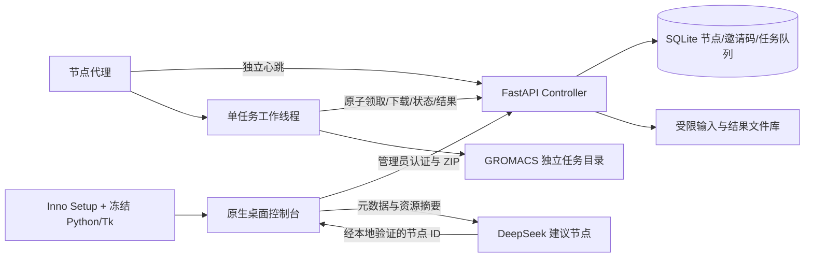

# 架构与边界

跨机通信使用加密 Tailscale 链路或外置 HTTPS。控制端使用 SQLite，适合单进程、小规模私有部署；任务领取使用 BEGIN IMMEDIATE 事务，单节点最多一个新版运行任务。任务具有租约和持久恢复记录，失联保留所有权，原节点恢复后补传结果；无高可用和永久故障的跨机接管。新旧队列不应混用于同一节点。

Controller 与 Agent 由同一冻结可执行程序提供，当前用户后台运行，不是系统服务。新版本添加 tasks_v2/packages_v2 表，保留旧数据。运行配置与数据库在用户运行目录，安装目录仅程序。DeepSeek 与远程管理凭据用当前用户 DPAPI 加密；节点令牌与主控 secret 仍为受 ACL 保护的本地文件。科学输入、结果不加密落盘。
