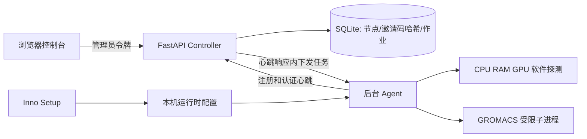

# 架构与边界

跨电脑通信走 Tailscale；每个节点分别执行独立作业，不通过互联网拼接一个 MPI 轨迹。
Controller 和 Agent 由同一个冻结 Python 可执行程序提供。安装时选择角色，以当前用户运行，数据不写入程序安装目录。

SQLite 单控制端、单进程部署；不支持多 worker 竞争领取、作业租约恢复和高可用。节点同步执行长任务时不持续心跳，因此目前仅作为部署和短作业验证 MVP。未连接真实实验体系，不提供计算可信度或科学有效性结论。
